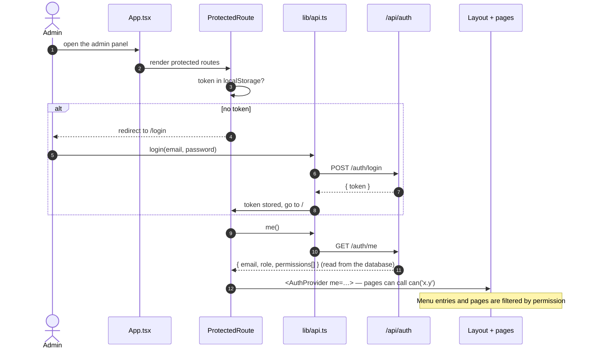
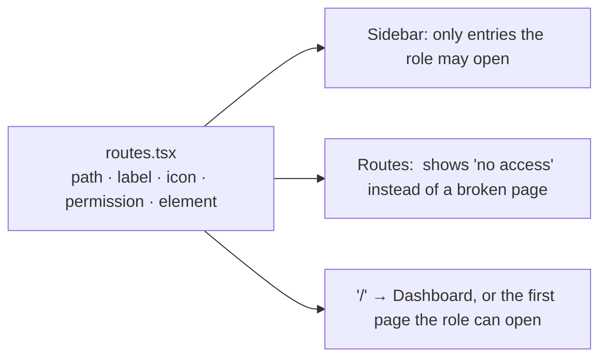
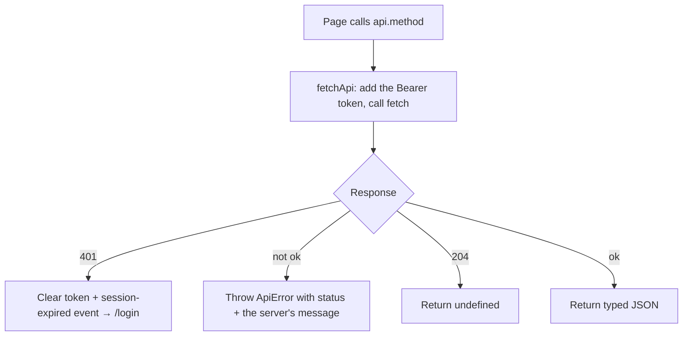
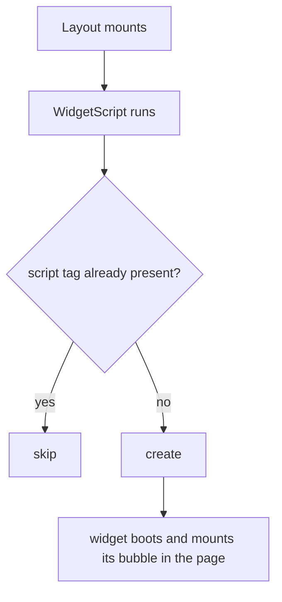

# Admin dashboard — code flow

How `@minichatbot/admin` (React + Vite + TypeScript SPA) signs in, decides what each person can see, talks to the server and loads pages. For where files live and how to add a page, see [`../../../docs/ARCHITECTURE.md`](../../../docs/ARCHITECTURE.md).

---

## 1. Sign-in and permissions

- Only the **token** is stored in the browser. Who you are and what you may do is fetched from the server each time the app loads — it can't be edited in devtools to unlock anything. (And hidden UI is a convenience, not security: the server checks every request.)
- If any call comes back **401** (session expired, or the account was removed), `lib/api.ts` clears the token and fires a `session-expired` event; `ProtectedRoute` listens and returns to `/login`.

---

## 2. Pages are generated from one table (`src/routes.tsx`)

Every page is lazy-loaded, so the first load ships only the shell and the page being opened; the others download on demand. Inside a page, actions use `can('faqs.delete')`, `<Can>` or `<ReadOnlyGuard>` (turns a whole form read-only without `settings.edit`).

---

## 3. API layer (`src/lib/api.ts`)

All server calls live in this one file — one method per endpoint, typed with the shared DTOs.

Uploads and file downloads use the same `fetchApi`, so errors and expiry are handled identically everywhere. A page catches the error and shows it with a toast or an inline alert.

---

## 4. The embedded widget preview

`components/WidgetScript.tsx` injects the real `widget.js` into the admin panel so admins use exactly what visitors see:

---

## 5. Pages

| Menu | Page | What it does (and the permission it needs) |
|---|---|---|
| Dashboard | `Dashboard.tsx` | Metrics, usage charts, live sessions — `dashboard.view` |
| Knowledge Base | `RestrictedWords.tsx`, `Faqs.tsx`, `QuestionChunks.tsx`, `Documents.tsx` (Content), `Fallbacks.tsx`, `UnansweredQuestions.tsx` | Manage what the bot knows and how it answers — `words.*`, `faqs.*`, `chunks.*`, `documents.*`, `settings.view`, `unanswered.*` |
| Analytics & Logs | `ChatLogs.tsx`, `Firebase.tsx` | Transcripts, blocking, export; Firestore reports — `conversations.*`, `reports.view` |
| Agents & AI | `ChatAgent.tsx`, `Voice.tsx`, `VectorAgent.tsx` | Provider/model/prompt, speech, embeddings and chunking — `settings.view` (+ `settings.edit` to change) |
| System | `Settings.tsx` | Widget look, availability, hours, caching, limits, chat users, SQL console, database tools — `settings.view` |
| System | `AccessControl.tsx` | Admin users, roles & permissions, audit log — `users.view` / `roles.view` / `audit.view` |

Knowledge Base menu entries carry a thin left accent in the color of the answer type they feed (the same colors as the widget's answer edge and Chat Logs badges).
