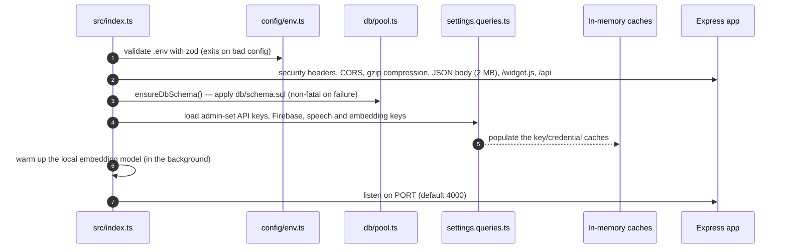
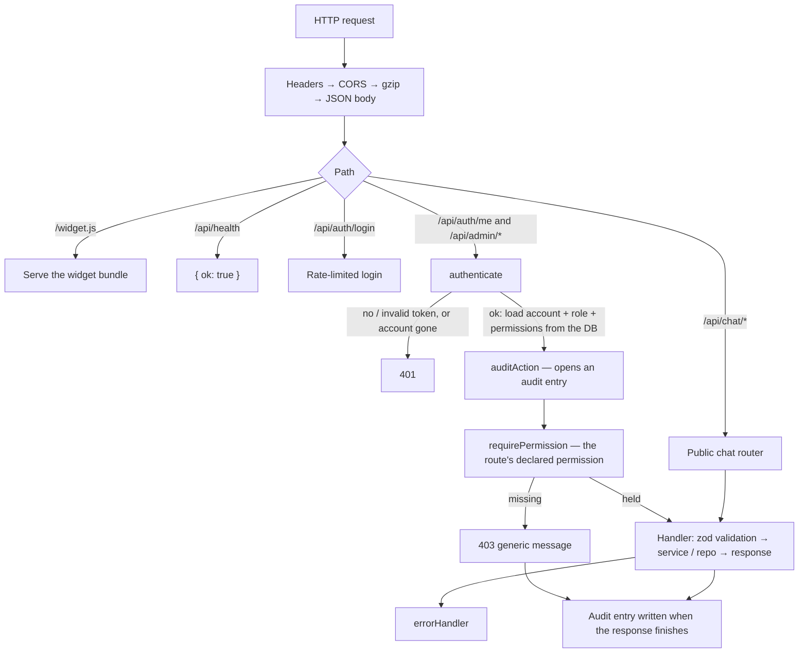
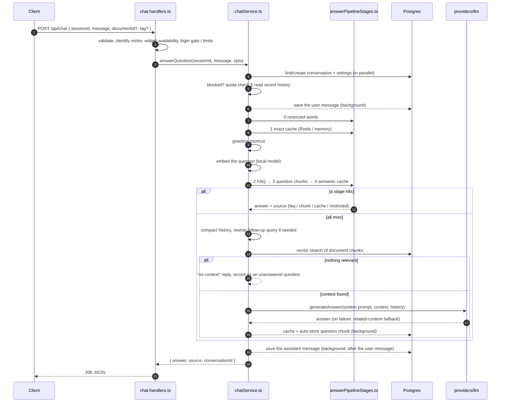
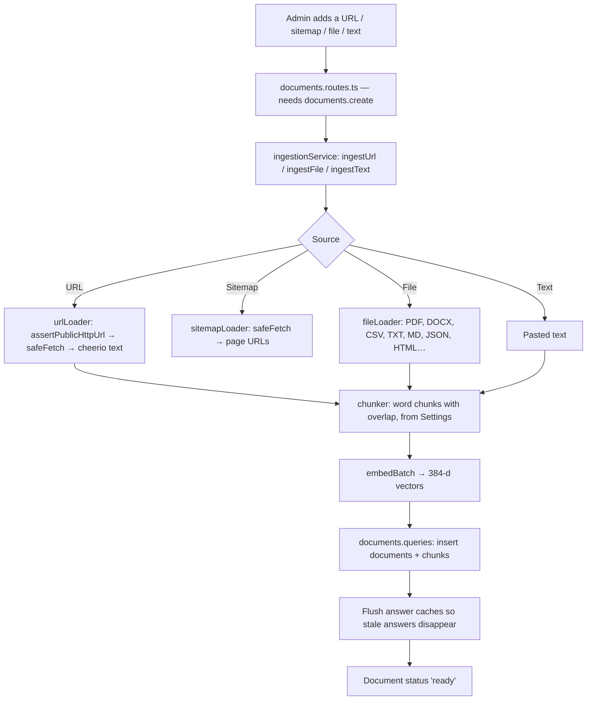

# Server — code flow

How `@minichatbot/server` (Express + TypeScript + Postgres `pgvector` + optional Redis) starts, handles a request, answers a question and ingests content. For where files live and how to add to them, see [`../../../docs/ARCHITECTURE.md`](../../../docs/ARCHITECTURE.md).

---

## 1. Boot (`src/index.ts`)

Migrations in `db/migrations/` are applied separately with `npm run migrate` (or the admin panel's Database tab).

---

## 2. Request routing, authentication and permissions

- **Authentication** (`features/auth/authMiddleware.ts`) proves who the caller is. The token holds identity only; the account, role and permissions are read from the database **on every request**, so changing a role or deleting an account takes effect immediately. Admin tokens carry audience `admin`, visitor tokens `visitor`, so one can never be used as the other.
- **Authorization** is `requirePermission(...)`, added by `registerSecuredRoutes` from the `permission` declared on each route. A route without one doesn't compile.
- **Audit** entries record who did what and the outcome (denied attempts included); request bodies are never logged.
- **Errors** become responses in `middleware/errorHandler.ts`: `HttpError` → its status, `ZodError` → 400, anything else → logged and a generic 500 in production.

---

## 3. Answering a question (`chatService.ts` → `answerQuestion`)

`answerQuestion` is a short coordinator: `startTurn` (turn.ts) → `tryFastPath` (fastPath.ts) → `retrieveKnowledge` (knowledgeRetrieval.ts) → `generateAnswer` (answerGeneration.ts), with `noAnswer.ts` handling the cases where the AI can't answer and `rememberAnswer.ts` saving what is worth keeping. The diagram below shows what happens across those steps.

Sources reported to the widget: `faq`, `chunk`, `cache`, `restricted`, `llm`, `chunk-fallback`, `no-match`.

**Latency design.** Work the visitor doesn't need before the answer (saving the transcript, cache writes, Firebase mirroring) runs in the background with failures logged. Small, rarely-changing reads (restricted words, the FAQ list used for typo matching) are cached for 30 s in `utils/ttlCache.ts` and dropped on any write. The slowest step is almost always the LLM call: the Gemini provider disables model "thinking", gives each model a 10 s budget and fails over to the next.

---

## 4. Content ingestion (`ingestionService.ts`)

URL and sitemap fetching never reaches private or internal addresses (checked on every redirect hop) unless `ALLOW_PRIVATE_URL_FETCH=true`.

---

## 5. Where to look

| Task | File |
|---|---|
| Boot, middleware, `/widget.js` | `src/index.ts` |
| Every mounted router | `src/routes/index.ts` |
| Defining or requiring a permission | `src/shared/permissions.ts`, `src/utils/registerRoutes.ts` |
| Who is the caller / what may they do | `src/features/auth/authMiddleware.ts`, `authorization.ts` |
| The answer pipeline | `src/features/chat/chatService.ts` (coordinator), `fastPath.ts` (the stage list), `answerPipelineStages.ts` (each stage) |
| Public chat endpoints | `src/features/chat/chat.routes.ts`, `chat.handlers.ts` |
| Ingestion | `src/features/documents/ingestionService.ts` |
| LLM / speech / embedding vendors | `src/providers/{llm,speech,embedding}/` |
| Caching (Redis + memory fallback) | `src/cache/redis.ts` |
| Optional Firestore mirror | `src/features/reports/firebaseMirror.ts` |
| Audit log | `src/features/audit/` |
