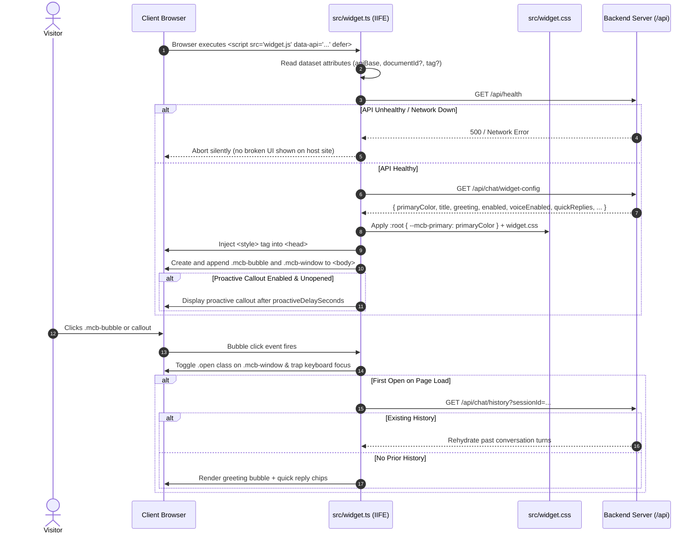
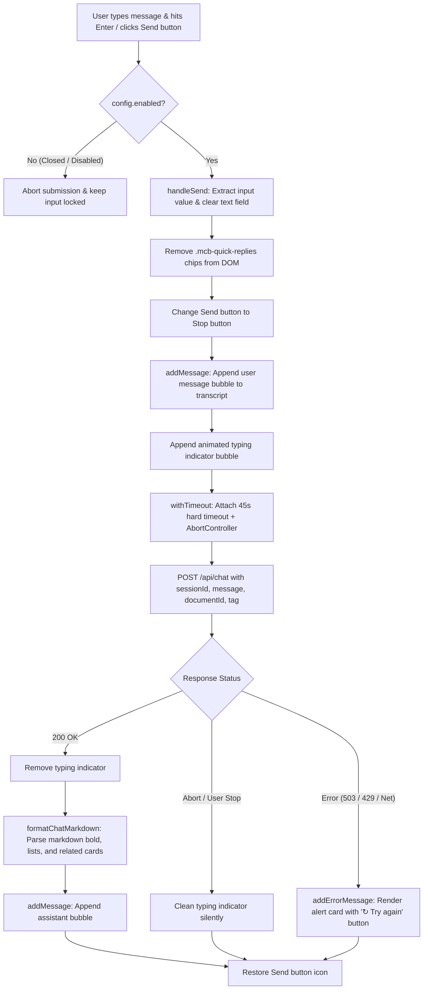
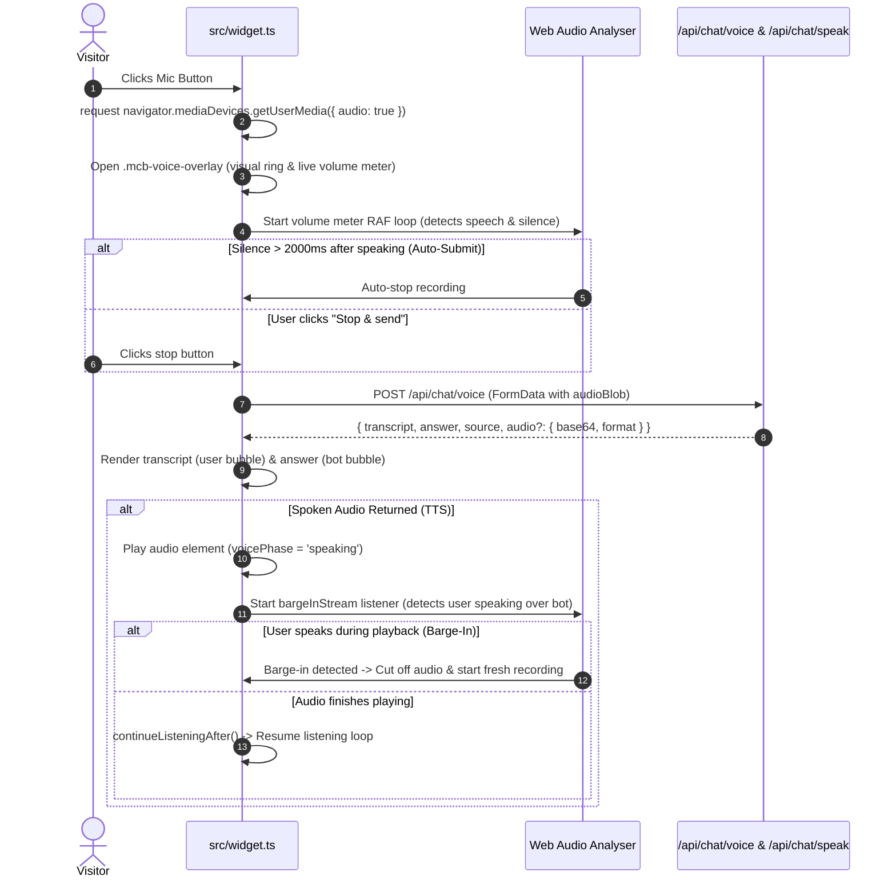

# Widget Runtime Architecture & Code Flow

Comprehensive code flow and architecture reference for `@minichatbot/widget` (Standalone Vanilla TypeScript IIFE Bundle).

---

## 1. Widget Lifecycle & DOM Injection Flow

---

## 2. Typed Message Submission Flow (`send`)

---

## 3. Spoken Voice & Continuous Conversation Flow

---

## 4. Function & Event Handlers Index

| Function | Line Scope | Purpose |
|---|---|---|
| `init()` | Boot | Reads script tag attributes, checks API health, fetches configuration, and mounts DOM elements. |
| `formatChatMarkdown()` | Message Render | HTML-escapes text, parses bold, converts bullet points to lists, and transforms `Related articles:` into card grids. |
| `send()` | Q&A Pipeline | Dispatches chat requests, manages typing indicators, abort signals, timeouts, and error retry cards. |
| `startRecording()` / `sendVoice()` | Voice Input | Controls Web Audio recording, volume animation, interim browser captions, and server upload. |
| `cancelRecording()` | Voice Exit | Halts recording/playback, disarms mic, and returns to chat view via the "Back to chat" button. |
| `listenForBargeIn()` | Interruption | Monitors secondary microphone stream during bot speech to enable immediate conversation barge-in. |
| `trapFocus()` | Accessibility | Traps keyboard focus (`Tab` / `Shift+Tab`) and handles `Escape` key inside open widget dialog. |
