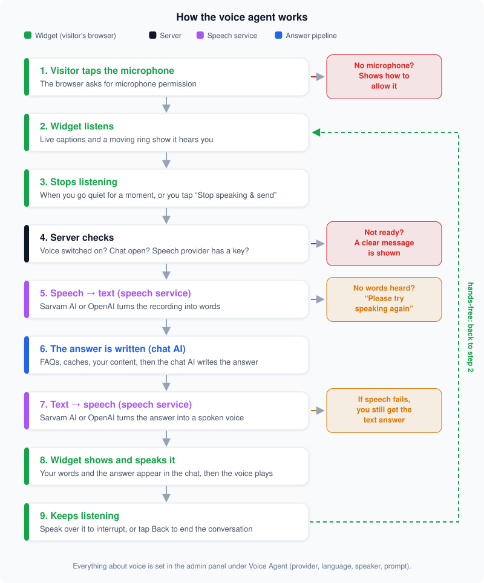

# The voice agent

The voice agent lets a visitor **talk to the chatbot instead of typing**, and hear the answer spoken back. It is hands-free: after each answer it listens again, so it works like a phone call.

## What the visitor experiences

1. They tap the **microphone** button in the chat window (the browser asks permission the first time).
2. A full-screen voice view opens. A ring moves with their voice, live captions show what is being heard, and the status says **Listening…**
3. When they stop talking for a moment, it sends the recording automatically (or they tap **Stop speaking & send**). The status changes to **Thinking…**
4. Their words and the answer both appear in the chat, and the answer is **spoken aloud** (**Speaking…**).
5. When the voice finishes, it starts **listening again** on its own. They can also **speak over the voice to interrupt** it. They tap **Back** to end the conversation.

If the microphone is blocked, the widget shows a short message explaining how to allow it. If nothing could be understood, it asks them to try again.

## Two different AIs are involved

Voice uses **two separate AI services**. People often mix them up:

| | Does what | Which one | Chosen where |
| --- | --- | --- | --- |
| **Speech service** | Turns your voice into text (step 5) and the answer back into a voice (step 7) | **Sarvam AI** or **OpenAI** | Voice Agent → *Provider, Model & Tuning* |
| **Chat AI** | Reads your question and your content and **writes the answer** (step 6) | **Gemini, OpenAI (ChatGPT), Claude** or a custom one | Chat Agent |

So "OpenAI" can appear twice — once as the speech service (speech-to-text and text-to-speech) and once as the chat AI — and they can be different choices. You could, for example, use Sarvam AI for speech and Gemini for the answers. Each needs its own API key.

The answer step is not special for voice: it first tries blocked words, the caches, FAQs and Question Chunks, and only asks the chat AI if none of them can answer. That's why a spoken question that was asked before is answered almost instantly.

## What happens behind the scenes

| Step | Where | What |
| --- | --- | --- |
| Listen | Widget | Records the microphone, shows captions and a level ring, notices silence |
| Send | Widget → Server | Uploads the recording to `POST /api/chat/voice` (up to 15 MB; rate-limited) |
| Check | Server | Is voice switched on? Is the chat available (opening hours, widget on)? Does the speech provider have a key? |
| Speech → text | Speech service | Sarvam AI or OpenAI turns the audio into words (in the language chosen for the Voice Agent) |
| Answer | Server | The words go through the **same answer steps as typed chat** (see the main README), with the Voice Agent's own prompt and settings applied |
| Text → speech | Speech service | The answer (cleaned of links and formatting so it sounds natural) becomes audio |
| Reply | Server → Widget | Sends the transcript, the answer text and the audio. If speech fails, you still get the text answer |
| Show and speak | Widget | Adds both messages to the chat, plays the audio, then listens again |

Because the answer comes from the normal pipeline, everything you teach the bot (FAQs, Question Chunks, your content, restricted words) works for voice too. Voice questions are saved in Chat Logs like any other, with a small badge showing they were spoken.

## How to set it up

In the admin panel, open **Voice Agent**:

| Tab | What you do there |
| --- | --- |
| **Provider, Model & Tuning** | Switch voice on ("Enable voice conversation feature"). Choose the speech provider (**Sarvam AI** or **OpenAI**), the **language** and the **speaker** voice. Optionally tune the answers for voice. |
| **Prompt** | Give voice its own instructions and its own "I don't have that information" reply. Spoken answers work best when short and plain. |
| **Context, History & Vector Chunks**, **Query Isolation & Pipeline** | Optional: use different limits and search settings for voice than for typed chat. |
| **API Keys** | Add the key for the provider you chose (or set `SARVAM_API_KEY` / `OPENAI_API_KEY` on the server). |
| **Usage Analytics** | See how much voice has been used. |

Most tabs only appear once voice is switched on. Without a key for the chosen provider, the server replies with a clear "no API key configured" message instead of failing silently.

## How many AI calls does one spoken question make?

| Step | Service | Calls |
| --- | --- | --- |
| Voice → text | Speech service (Sarvam AI / OpenAI) | 1 |
| Write the answer | Chat AI (Gemini / OpenAI / Claude…) | 1 — or **0** when a cache, FAQ or Question Chunk already has the answer |
| Text → voice | Speech service (Sarvam AI / OpenAI) | 1 |

So the speech service is called **twice** per spoken question, once for each direction. They are different jobs and can't run at the same time, because the voice step needs the finished answer. Extra calls happen only if a key fails and the server tries the next key.

## Speed

A spoken answer takes three steps one after another: speech → text, the answer, then text → speech. The server logs how long each took (`[chat/voice] transcribe … answer … synthesize … total …`) so you can see which one is slow. The answer step is the same as typed chat, so the speed advice in [`ARCHITECTURE.md`](ARCHITECTURE.md) applies here too.

## Where the code is

| What | File |
| --- | --- |
| The whole voice conversation in the widget | `apps/widget/src/core/voiceChat.ts` |
| Microphone, silence detection, playback, interrupting | `apps/widget/src/services/widgetAudio.ts` |
| The server endpoint | `apps/server/src/features/chat/chat.handlers.ts` (`handleVoice`) |
| Sarvam AI / OpenAI speech services | `apps/server/src/providers/speech/` |
| The admin's Voice Agent screen | `apps/admin/src/pages/Voice.tsx` |
